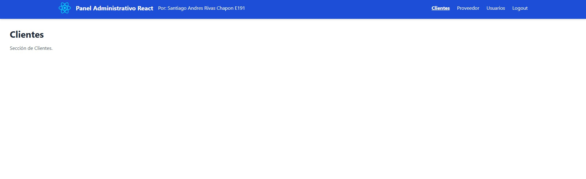

# Panel Administrativo en ReactJS

Este proyecto es un panel administrativo web desarrollado con **React** + **Vite** y estilizado con **Tailwind CSS** como parte del taller de Desarrollo de Aplicaciones Empresariales.

## Tecnologías

- [React](https://reactjs.org/)
- [Vite](https://vitejs.dev/)
- [Tailwind CSS](https://tailwindcss.com/)
- [React Router DOM](https://reactrouter.com/)

## Estructura
src/
├── components/
│   └── Navbar.jsx
├── pages/
│   ├── Clientes.jsx
│   ├── Proveedor.jsx
│   ├── Usuarios.jsx
│   └── Logout.jsx
├── App.jsx
├── index.css
└── main.jsx

## Captura de pantalla

## Por: Santiago Andres Rivas Chapon
